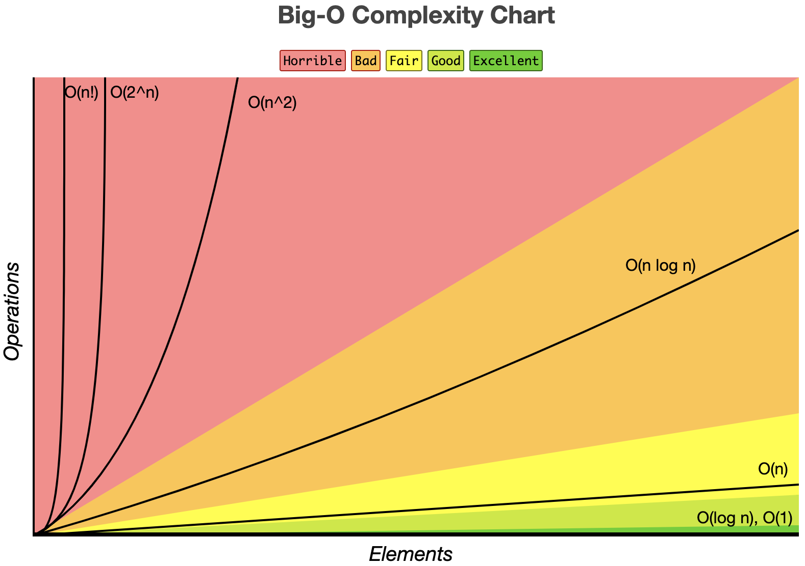

# 概念
 - 时间频度：一般来说哪个语句执行次数多，它花费时间就多。一个算法中的语句执行次数称为语句频度或时间频度。记为T(n)。
 - 常见的算法时间复杂度如[下图](https://www.bigocheatsheet.com/)所示：常数阶O(1)，对数阶O(log₂n)，线性阶O(n)，线性对数阶O(nlog₂n)，平方阶O(n²)，立方阶O(n³)，k次方阶O(nᵏ)，指数阶O(2ⁿ)
 

# 求解算法时间复杂度的具体步骤
- 找出算法中的基本语句
- 计算基本语句的执行次数的数量级
- 用大O记号表示算法的时间性能

## 常数阶O(1)和线性阶O(n)
```js
let temp=1, i=2, j=3;
temp=i;     // ① 该语句的频度为 1
i=j;        // ② 该语句的频度为 1
j=temp;     // ③ 该语句的频度为 1
```
因为**f(n) = 1+1+1**，所以它的时间复杂度为O(1)
```js
let a=0;                      // ① 该语句的频度为 1
let b=1;                      // ① 该语句的频度为 1
for (i=1; i<=n; i++){         // ② 该语句的频度为 n
  s=a+b;                      // ③ 该语句的频度为 n-1
  b=a;                        // ④ 该语句的频度为 n-1
  a=s;                        // ⑤ 该语句的频度为 n-1
}
```
因为**f(n)=1+1+n+3(n-1)=4n-1**，所以它的时间复杂度为O(n)

> 📌上面两个的区别是：第一段代码不和规模n有关，当算法的执行时间不随着问题规模n的增加而增长，即使算法中有上千条语句，其执行时间也不过是一个较大的常数，所以此类算法的时间复杂度是O(1)；**一般来说，只要算法中不存在循环语句，其时间复杂度就是Ο(1)**

## 平方阶O(n²)
```js
let sum=0;                      // ① 该语句的频度为 1
for(i=1; i<=n; i++) {           // ② 该语句的频度为 n
    for(j=1; j<=n; j++) {       // ③ 该语句的频度为 n*n
        sum++;                  // ④ 该语句的频度为 n*n
    }
}
```
因为**f(n)=1+n+n²+n²=2n²+n+1**，所以它的时间复杂度为 O(n²)

```js
for (i=1; i<n; i++) {
    y=y+1;                          // ① 该语句的频度为 n-1
    for(j=0; j<=2*n; j++) {
        x++;                        // ② 该语句的频度为 (n-1)*(2n+1) = 2n²-n-1
    }
}
```
因为**f(n)=2n²-n-1+n-1=2n²-1**，所以它的时间复杂度为 O(n²)

```js
for (i=0; i<n; i++) {               // ① 该语句的频度为 n
    for(j=0; j<=i; j++) {           
        x++;                        // ② 该语句的频度为 0+1+2+3+4+...+(n-1)=(n-1)n/2   
    }
}
```
因为内循环体的**f(n)=0+1+2+3+4+...+(n-1)=(n-1)n/2=n²/2-n/2**，所以它的时间复杂度为 O(n²)

## O(log₂n)
```js
i=1;                    // ① 该语句的频度为 1
while (i<=n) {
    i=i*2;              // ② 设该语句的频度为fn，则2^fn<=n，fn<=log₂n
}
```
fn取最大值，即**f(n)=1+log₂n**，所以它的时间复杂度为 O(log₂n)

## O(n³) 
```js
for(i=0; i<n; i++){             // ① 该语句的频度为 n
    for(j=0; j<n; j++){         // ② 该语句的频度为 n*n
        for(k=0; k<n; k++){     
            count+=1;           // ③ 该语句的频度为 n*n*n
        }
    }
}
```
因为**f(n)=n+n²+n³**，所以它的时间复杂度为 O(n³)


# 参考文章
- [算法的时间复杂度和空间复杂度-总结](https://blog.csdn.net/zolalad/article/details/11848739)
- [大O作弊表](https://www.bigocheatsheet.com/)

